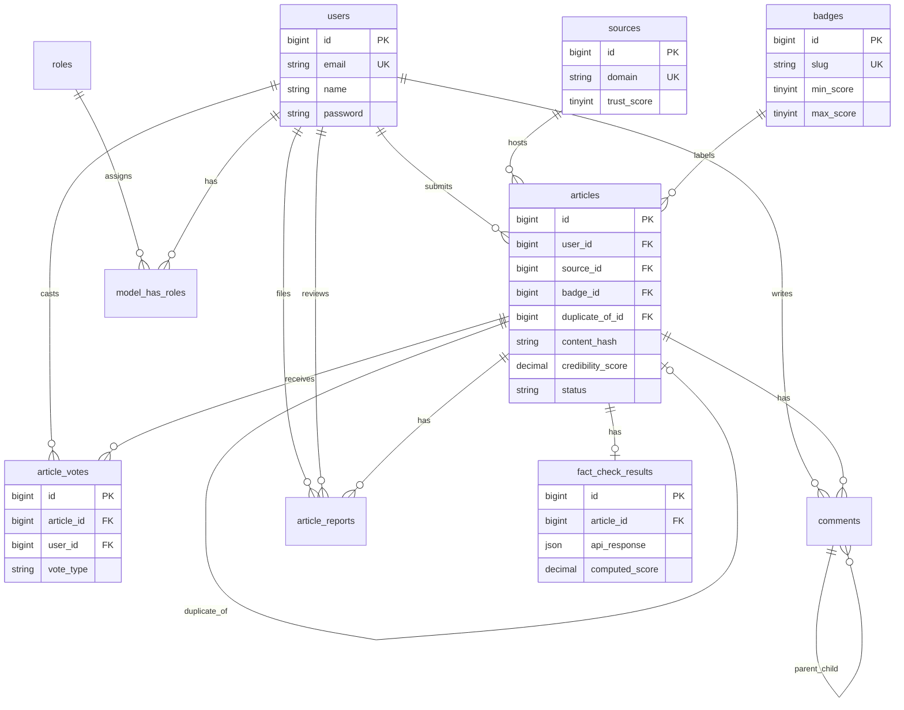

    # TruthLens — Database Schema & Normalization

Technical reference for database tables, relationships, and how the schema is normalized.

For end-user features, see [USER_GUIDE.md](USER_GUIDE.md). For installation, see [README.md](README.md).

---

## 1. Overview

TruthLens uses **MySQL** (or MariaDB) with **Laravel migrations**. The schema separates:

- **Identity** — users, roles, sessions
- **Content** — articles and their processing metadata
- **Reference data** — badges, sources (domains)
- **Analysis** — fact-check API payloads and scores
- **Engagement** — votes, comments, reports (comments/reports are modeled for future use)
- **Framework** — cache, jobs, notifications, password resets

---

## 2. Entity relationship diagram



---

## 3. Normalization summary

| Normal form | What it means | How TruthLens applies it |
|-------------|---------------|---------------------------|
| **1NF** | Atomic values; no repeating groups in one column | Each column holds a single value. Vote types are one row per user per article, not a comma-separated list. API claim reviews are stored as JSON in one row per article (see §3.5). |
| **2NF** | No partial dependency on a composite key | Tables with composite uniqueness (`article_id` + `user_id` on votes) store only attributes that depend on **both** keys. Badge name/color live in `badges`, not duplicated per article beyond `badge_id`. |
| **3NF** | No transitive dependency (non-key → non-key) | Domain trust settings live in `sources`, not repeated on every `articles` row. Badge thresholds live in `badges`. User profile fields stay on `users`. |

### 3.1 Intentional denormalization

Some columns duplicate data for **read performance** or **display convenience**:

| Table | Column | Why it exists |
|-------|--------|----------------|
| `articles` | `credibility_score` | Copied from analysis so the feed can list scores without joining `fact_check_results` every time. |
| `articles` | `badge_id` | Resolved at processing time from score; avoids runtime range lookup on every card. |
| `fact_check_results` | `computed_score` | Snapshot of the score at analysis time (matches `articles.credibility_score` when not a duplicate). |
| `sources` | `article_count` | Counter cache updated when articles link to a domain. |
| `comments` | `upvotes_count`, `downvotes_count` | Reserved for tallies without recounting child rows (not yet used in UI). |

These are **controlled denormalization**: values are set when the article is processed, not edited independently in normal flow.

### 3.2 Duplicate articles

`articles.duplicate_of_id` is a **self-referential foreign key**. When `content_hash` matches an existing completed article, the new row points to the original and copies `credibility_score` / `badge_id` without a new API call. This avoids storing identical fact-check payloads twice.

### 3.3 Lookup tables (reference entities)

| Table | Role |
|-------|------|
| `badges` | Defines Trusted / Suspicious / Fake / Unverified labels and score ranges. |
| `sources` | One row per unique hostname (`bbc.com`, `snopes.com`). |
| `roles` | admin, moderator, user (Spatie Permission). |

### 3.4 Junction / associative tables

| Table | Links |
|-------|-------|
| `article_votes` | `articles` ↔ `users` (one vote per pair) |
| `model_has_roles` | `users` ↔ `roles` |
| `model_has_permissions` | users ↔ permissions (optional direct grants) |

### 3.5 JSON in `fact_check_results.api_response`

The raw Google Fact Check API response can contain **many nested claims and reviews**. Normalizing each claim into `claims`, `claim_reviews`, and `publishers` tables would be **4NF/5NF-style** decomposition.

The project stores the **full API payload as JSON** because:

- The structure is defined by an external API and may vary.
- The UI reads a small subset via `FactCheckResult::claimReviews()`.
- One analysis run → one result row keeps writes simple.

This is a pragmatic trade-off: slightly less relational purity, easier maintenance.

---

## 4. Core application tables

### 4.1 `users`

Stores registered accounts.

| Column | Type | Null | Description |
|--------|------|------|-------------|
| `id` | bigint | PK | Surrogate primary key |
| `name` | varchar | | Display name |
| `email` | varchar | UK | Login identifier |
| `email_verified_at` | timestamp | yes | Email verification (optional feature) |
| `password` | varchar | | Hashed password |
| `avatar_path` | varchar | yes | Profile image path |
| `bio` | text | yes | Short profile text |
| `is_active` | boolean | | Account enabled flag |
| `notification_settings` | json | yes | Future notification preferences |
| `remember_token` | varchar | yes | “Stay logged in” token |
| `created_at`, `updated_at` | timestamp | | Laravel timestamps |

**Related tables:** `password_reset_tokens`, `sessions` (same migration file).

---

### 4.2 `articles`

Central table: each row is one user submission (URL or pasted text) and its analysis outcome.

| Column | Type | Null | Description |
|--------|------|------|-------------|
| `id` | bigint | PK | |
| `user_id` | bigint | FK → `users` | Who submitted |
| `source_id` | bigint | FK → `sources` | Domain extracted from URL (nullable) |
| `badge_id` | bigint | FK → `badges` | Assigned label after processing |
| `submission_type` | varchar(16) | | `url` or `text` |
| `url` | text | yes | Original link (URL mode) |
| `title` | varchar | yes | Headline / claim |
| `content` | longtext | | Normalized body text |
| `content_hash` | char(64) | yes, indexed | SHA-256 of normalized content (duplicate detection) |
| `category` | varchar | yes, indexed | User tag (Health, Politics, …) |
| `credibility_score` | decimal(5,2) | yes | 0–100; null = Unverified |
| `status` | varchar(32) | indexed | `pending`, `processing`, `completed`, `failed` |
| `duplicate_of_id` | bigint | FK → `articles` | Points to first article with same hash |
| `processed_at` | timestamp | yes | When analysis finished |
| `published_at` | timestamp | yes | Reserved for future publishing workflow |
| `created_at`, `updated_at` | timestamp | | |

**Indexes:** `content_hash`, `category`, `status` — feed filtering and duplicate lookup.

**Delete rules:** Deleting a user cascades to their articles. Deleting a source or badge nulls the FK on articles.

---

### 4.3 `badges`

Reference table for credibility labels. Seeded by `BadgeSeeder`.

| Column | Type | Description |
|--------|------|-------------|
| `id` | bigint PK | |
| `name` | varchar | Display name (Trusted, Suspicious, …) |
| `slug` | varchar UK | Machine key (`trusted`, `fake`, …) |
| `color` | varchar(32) | Hex colour for UI |
| `min_score` | tinyint | Lower bound (null for Unverified) |
| `max_score` | tinyint | Upper bound (null for Unverified) |

**Example seed data:**

| slug | min | max |
|------|-----|-----|
| trusted | 70 | 100 |
| suspicious | 40 | 69 |
| fake | 0 | 39 |
| unverified | null | null |

---

### 4.4 `sources`

One row per **unique website domain** seen in URL submissions.

| Column | Type | Description |
|--------|------|-------------|
| `id` | bigint PK | |
| `domain` | varchar UK | e.g. `politifact.com` |
| `trust_score` | tinyint | Default 50; reserved for future trust ranking |
| `is_banned` | boolean | Reserved for blocking domains |
| `article_count` | int | Denormalized count of linked articles |

**Normalization note:** Domain is not repeated on every article string; articles reference `source_id`.

---

### 4.5 `fact_check_results`

One row per article that received an API analysis (not created for pure duplicates that skip the API).

| Column | Type | Description |
|--------|------|-------------|
| `id` | bigint PK | |
| `article_id` | bigint FK → `articles` | 1:1 in practice (`updateOrCreate`) |
| `api_response` | json | Full Google Fact Check API payload |
| `computed_score` | decimal(5,2) | Score calculated at analysis time |
| `verdict` | varchar(64) | e.g. `mostly_supported`, `mixed`, `mostly_disputed`, `no_match` |

**Delete rule:** Cascade when article is deleted.

---

### 4.6 `article_votes`

Community credibility votes.

| Column | Type | Description |
|--------|------|-------------|
| `id` | bigint PK | |
| `article_id` | bigint FK | |
| `user_id` | bigint FK | |
| `vote_type` | varchar(16) | `real` or `fake` |

**Unique constraint:** `(article_id, user_id)` — enforces one vote per user per article (2NF on composite key).

---

### 4.7 `comments` *(schema ready; UI not implemented)*

Threaded discussion on articles.

| Column | Type | Description |
|--------|------|-------------|
| `id` | bigint PK | |
| `article_id` | bigint FK | |
| `user_id` | bigint FK | |
| `parent_id` | bigint FK → `comments` | Nested replies |
| `body` | text | Comment text |
| `upvotes_count` | int | Denormalized tally |
| `downvotes_count` | int | Denormalized tally |

---

### 4.8 `article_reports`

User flags on misleading content. Submitted from the article detail page; reviewed in the staff report queue (`/admin/reports`).

| Column | Type | Description |
|--------|------|-------------|
| `id` | bigint PK | |
| `article_id` | bigint FK | |
| `user_id` | bigint FK | Reporter |
| `category` | varchar(32) | `misleading`, `satire`, `out_of_context`, `fabricated`, `other` |
| `details` | text | Optional explanation |
| `status` | varchar(32) | `pending`, `reviewed`, `dismissed` |
| `reviewed_by` | bigint FK → `users` | Moderator/admin who resolved the report |
| `reviewed_at` | timestamp | When resolved |

**Staff UI:** list, filter, mark reviewed/dismissed, CSV export at `GET /admin/reports/export`.

---

## 5. Authentication & authorization tables

### 5.1 Spatie Permission (`roles`, `permissions`, pivots)

| Table | Purpose |
|-------|---------|
| `roles` | Named roles (`admin`, `moderator`, `user`) |
| `permissions` | `view all articles`, `review reports`, `manage sources` (seeded by `PermissionSeeder`) |
| `model_has_roles` | Assigns roles to `User` (polymorphic) |
| `model_has_permissions` | Direct user permissions (optional) |
| `role_has_permissions` | Permissions attached to roles |

**Role → permission mapping** (see `database/seeders/PermissionSeeder.php`):

| Role | Permissions |
|------|-------------|
| `moderator` | view all articles, review reports, manage sources |
| `admin` | All permissions |
| `user` | None (standard app features only) |

**Route protection:** staff pages use middleware `role:admin|moderator` under the `/admin` prefix.

### 5.2 `sessions`

Server-side session storage when `SESSION_DRIVER=database`.

| Column | Description |
|--------|-------------|
| `id` | Session ID |
| `user_id` | Logged-in user (nullable) |
| `payload` | Serialized session data |
| `last_activity` | Expiry / garbage collection |

### 5.3 `password_reset_tokens`

| Column | Description |
|--------|-------------|
| `email` | PK — user requesting reset |
| `token` | Reset token hash |
| `created_at` | Token age |

---

## 6. Framework & infrastructure tables

| Table | Purpose |
|-------|---------|
| `cache` / `cache_locks` | Database cache driver |
| `jobs` / `job_batches` / `failed_jobs` | Queue workers (`ProcessArticleSubmission`) |
| `notifications` | Laravel notification channel storage |

These support Laravel runtime behaviour and are not specific to TruthLens business logic.

---

## 7. Relationships (Laravel models)

| Parent | Child | Type | FK |
|--------|-------|------|-----|
| `User` | `Article` | 1:N | `articles.user_id` |
| `User` | `ArticleVote` | 1:N | `article_votes.user_id` |
| `Source` | `Article` | 1:N | `articles.source_id` |
| `Badge` | `Article` | 1:N | `articles.badge_id` |
| `Article` | `FactCheckResult` | 1:1 | `fact_check_results.article_id` |
| `Article` | `ArticleVote` | 1:N | `article_votes.article_id` |
| `Article` | `Article` | self | `articles.duplicate_of_id` |
| `Article` | `Comment` | 1:N | `comments.article_id` |
| `Article` | `ArticleReport` | 1:N | `article_reports.article_id` |

---

## 8. Data flow at insert time

```
1. User submits → INSERT articles (status = pending)
2. Job runs     → UPDATE articles (status = processing)
3. If duplicate hash → UPDATE articles (duplicate_of_id, badge_id, score); STOP
4. Else API call → INSERT/UPDATE fact_check_results
                 → UPDATE articles (badge_id, credibility_score, status = completed)
5. If URL       → INSERT/UPDATE sources; SET articles.source_id
6. User reports → INSERT article_reports (status = pending)
7. Staff review → UPDATE article_reports (status, reviewed_by, reviewed_at)
```

---

## 9. Enumerated values (application layer)

Stored as strings in the database; cast to PHP enums in models.

| Field | Allowed values |
|-------|----------------|
| `articles.submission_type` | `url`, `text` |
| `articles.status` | `pending`, `processing`, `completed`, `failed` |
| `article_votes.vote_type` | `real`, `fake` |
| `article_reports.category` | `misleading`, `satire`, `out_of_context`, `fabricated`, `other` |
| `article_reports.status` | `pending`, `reviewed`, `dismissed` |
| `fact_check_results.verdict` | `mostly_supported`, `mixed`, `mostly_disputed`, `no_match`, `unmatched_reviews`, or null |

---

## 10. Integrity rules summary

| Rule | Enforcement |
|------|-------------|
| One vote per user per article | `UNIQUE (article_id, user_id)` on `article_votes` |
| One domain per source row | `UNIQUE (domain)` on `sources` |
| One badge slug | `UNIQUE (slug)` on `badges` |
| One email per account | `UNIQUE (email)` on `users` |
| Orphan votes prevented | `ON DELETE CASCADE` from articles/users |
| Badge/source removal | `ON DELETE SET NULL` on `articles` FKs |

---

## 11. Suggested indexes (existing)

| Table | Index | Use case |
|-------|-------|----------|
| `articles` | `content_hash` | Duplicate detection |
| `articles` | `status` | Feed (`WHERE status = completed`) |
| `articles` | `category` | Future category filter |
| `article_reports` | `status` | Moderation queue |

---

## 12. Future normalization options

If the product grows, consider:

1. **Split `fact_check_results`** into `claims`, `claim_reviews`, `publishers` tables if you need SQL reporting on individual reviews.
2. **Remove `credibility_score` from `articles`** and always join `fact_check_results` (purer 3NF, more joins).
3. **Vote tallies** — materialized counts on `articles` if vote volume is high (currently counted at read time).
4. **Soft deletes** on `articles` for moderation without losing history.

---

## 13. Table list (quick reference)

| # | Table | Category |
|---|-------|----------|
| 1 | `users` | Identity |
| 2 | `articles` | Core content |
| 3 | `badges` | Reference |
| 4 | `sources` | Reference |
| 5 | `fact_check_results` | Analysis |
| 6 | `article_votes` | Engagement |
| 7 | `comments` | Engagement (future) |
| 8 | `article_reports` | Moderation |
| 9 | `roles` | Authorization |
| 10 | `permissions` | Authorization |
| 11 | `model_has_roles` | Authorization pivot |
| 12 | `model_has_permissions` | Authorization pivot |
| 13 | `role_has_permissions` | Authorization pivot |
| 14 | `sessions` | Auth infrastructure |
| 15 | `password_reset_tokens` | Auth infrastructure |
| 16 | `notifications` | Framework |
| 17 | `cache`, `cache_locks` | Framework |
| 18 | `jobs`, `job_batches`, `failed_jobs` | Framework |

---

*Generated from Laravel migrations in `database/migrations/`.*
